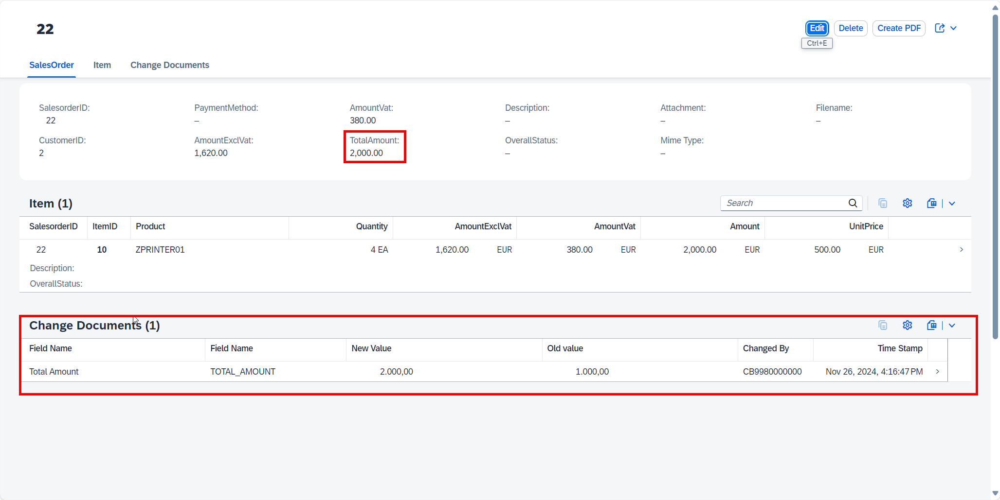
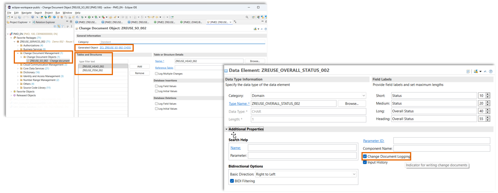
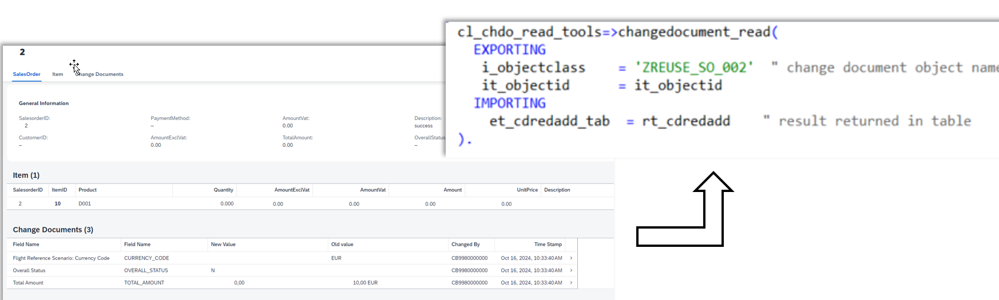
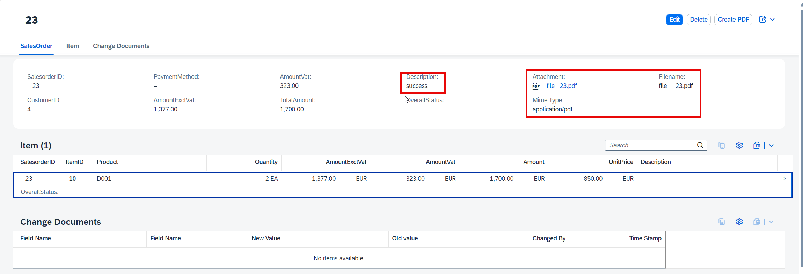
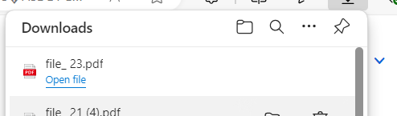
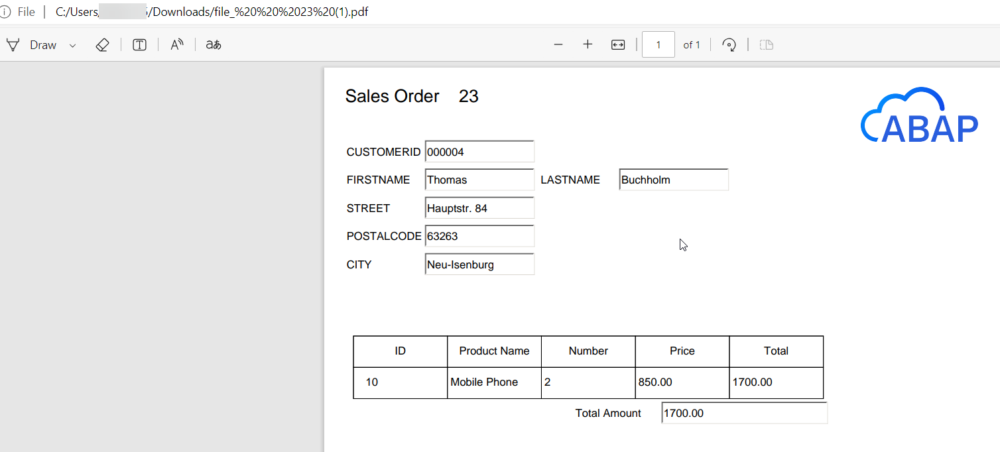

# Reuse services in ABAP Cloud
<!-- Please include descriptive title -->

## Description

In this repository you will find sample code that shows how to work with the following reuse services:   

- Number Ranges
- Change Documents
- Adobe Forms Service

The repository contains a simple sample RAP business objects to create sales orders and items. The semantic key for the sales orders is drawn from a _number range object_. Changes to two fields of the sales order are recorded using a _change document object_ and to data elements for the _total amount_ and the _overall status_ that have been configured appropriately to record changes.  

Using an action the sample also shows how content of a sales order entity including its items can be used to fill a form from the _Adobe Forms Service_ to create a PDF document.  

### Number Ranges

When you create a sales order a new number will be drawn from a number range. The RAP business object uses early numbering.

### Change Documents

The repository contains a change document object based on the two underlying tables that are used to store the sales order data and the data of the items.  
Two fields **Amount** and **Overall Status** of the sales order data table use data elements where the _Change Documeng Logging_ has been enabled. Only changes are recorded, not the inital values.  
That means that after you have created a sales order and change an item or add an item the total amaount will be changed as well and this change will be recorded and displayed in the Fiori Elements OData V4 app.

Demo Flow:  
1. Create a new Salesorder
2. Create an Item
   - Select a product
   - Enter a quantity, e.g. "2"
   - Press Apply
3. Press "Create" to create the SalesOrder
4. Press "Edit"
5. Change the quantity to another value, e.g. "4"
6. Press "Save"

Changes to the field "TotalAmount" are saved and displayed via a custom entity, not the reuse-library, since the demo app is an OData V4 app.

    

#### Implementation details   

The change document object 'ZREUSE_SO_002' only records changes not any initial values. Therefore the changes are only visible after the initial values for a salesorder are changed.
For the data element 'ZREUSE_TOTAL_AMOUNT_002' in the additional properties the flag **change document logging** has been activated.  

     

The display of changes is done using a custom entity 'ZREUSEI_CDREDADD_002' that uses the change document API in the query implementation class 'ZREUSECL_GET_CHANGE_DOCS_002' to read the data

 

### Adobe Forms Service 

1. Create a new Salesorder
2.  Select a customer
3.  Create an Item
    - Select a product
    - Enter a quantity, e.g. "2"
    - Press Apply
4. Create a second item
5. Press "Create" to create the SalesOrder
6. Press the "Create PDF" button, the description changes to "PDF generation started" and wait a few seconds
7. Refresh the browser
8. Description changes to "success" and a PDF is show as an attachement that contains the salesorder data

  

The field "Description" shall contain the value "Success" (the demo will be changed such that the field "overallstatus" will be changed instead)

The field attachement will contain the binary data of a PDF that has been generated using the Adobe Forms Service in SAP BTP. The document contains values from the SalesOrder that has been created.

When you click on the link "file_23.pdf" the file will be offered for download and you can open it. 

  

The demo uses a very simple PDF template 'ZREUSEUI_SALESORDER_002_ADS' with a form also called 'ZREUSEUI_SALESORDER_002_ADS'. 

  

## Requirements

- Adobe Forms Service

## Download and Installation

Create a package, e.g. **'ZREUSE_SERVICES_002'** and link this package with the URL of this repository.

## Known Issues
<!-- You may simply state "No known issues. -->

The import of the change document object 'ZREUSE_SO_002' currently fails. As a result you have to create the same after the import of the repository manually.   

   
  
Click to expand!
   

1. Right click on the package where you have imported this repository.   
2. Choose **New --> Other repository object** from the context menue.   
3. Search for **Change** and select **Change Document Object**.   
4. Press **Next**.   
5. Enter the following values:  
   -  **Name**: 'ZREUSE_SO_002'.  
   -  **Description**: 'Change Documents'.  
6. Press **Next**.  
7. Select or create a transport request.  
8. Press **Finish**.  
9. Press **Add** and enter the following value.  
   - **Name**: 'ZREUSE_HEAD_002'.  
10. Press **Add** and enter the following value.  
    - **Name**: 'ZREUSE_ITEM_002'.  
11. Press **Save**.  
12. Press **Ctrl+F3** to activate your changes.  

   

## How to obtain support
[Create an issue](https://github.com/SAP-samples/abap-platform-reuse-services/issues) in this repository if you find a bug or have questions about the content.
 
For additional support, [ask a question in SAP Community](https://answers.sap.com/questions/ask.html).

## Contributing
If you wish to contribute code, offer fixes or improvements, please send a pull request. Due to legal reasons, contributors will be asked to accept a DCO when they create the first pull request to this project. This happens in an automated fashion during the submission process. SAP uses [the standard DCO text of the Linux Foundation](https://developercertificate.org/).

## License
Copyright (c) 2024 SAP SE or an SAP affiliate company. All rights reserved. This project is licensed under the Apache Software License, version 2.0 except as noted otherwise in the [LICENSE](LICENSE) file.
